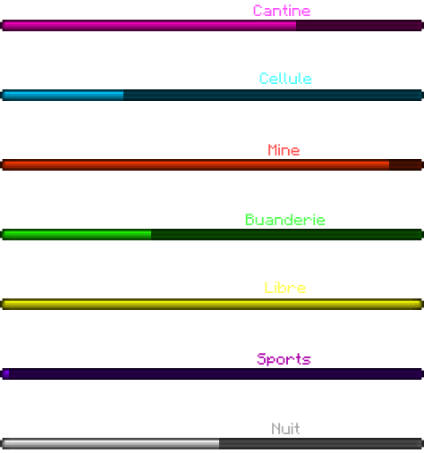

  
  <h1>Questify</h1>
  
  

    Un plugin Minecraft 100% <b>customizable</b>
  

  
<!-- Badges -->

  
  
  
  

   
<h4>
    <a href="https://github.com/AxenoDev/questify/wiki">Wiki</a>
   · 
    <a href="https://github.com/AxenoDev/questify/issues/">Signaler un bug</a>
  </h4>

 

<!-- Table of Contents -->
# :notebook_with_decorative_cover: Sommaires

- [A propos](#star2-a-propos)
  * [Fonctionnalitées](#dart-fonctionnalités)
- [Installation](#toolbox-installation)
  * [Prérequis](#bangbang-prérequis)
  * [Download](#gear-download)
- [Exemples](#eyes-exemple)
- [A venir](#compass-a-venir)
  

<!-- About the Project -->
## :star2: A propos

Questify est un plugin <a href="https://www.minecraft.com">Minecraft</a> pour rendre le RP plus immersif entièrement développé en <a href="https://java.com">Java</a>.

<!-- Features -->
### :dart: Fonctionnalités

- Fonctionne avec les barres de boss
- 100% customizable

<!-- Getting Started -->
## 	:toolbox: Installation

<!-- Prerequisites -->
### :bangbang: Prérequis

Questify a besoin de deux autre plugins pour fonctionner: [WorldGuard](https://dev.bukkit.org/projects/worldguard) et [WorldEdit](https://www.curseforge.com/minecraft/mc-mods/worldedit).

<!-- Installation -->
### :gear: Download

Questify va bientôt être publié sur Spigot...

<!-- Example -->
## :eyes: Exemple

Voici ce qu'on peut faire avec le plugin Questify:

 
  

<!-- Roadmap -->
## :compass: A venir
* [x] Système de timer en boss bar
* [ ] Choisir le system de timer en action bar
* [ ] Faire une API pour les devs
* [ ] Faire un addon pour skript
